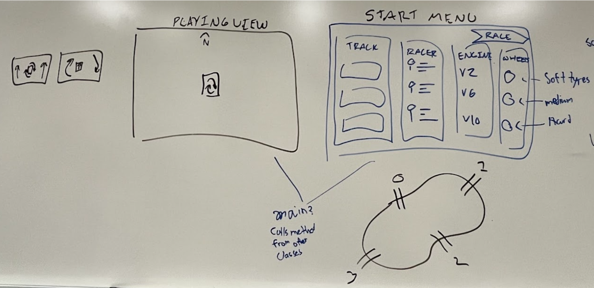
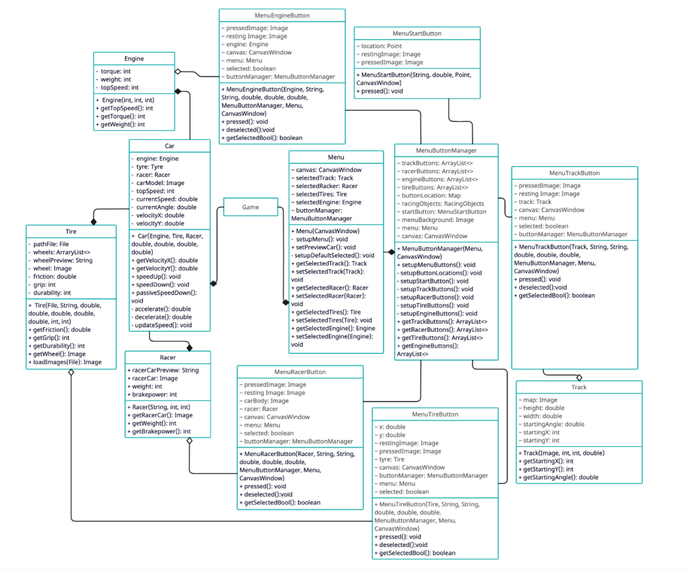

# F1 Game

Sam C, Andre, Isauro, Chris

The Verstappens

It is a 2-D racing game using pixelated cars driving around real tracks.
Everyone likes racing games, so it would be fun to make one. The game is centered
around the player racing through different real-life inspired ciruits. The player
is able to choose different selections to customize the car. 

The inspiration for this project comes from wanting a car physics simulation,
then the love of games by all the group members have allowed it to transform
into a racing game. The project is inspired from Unlimited Racing 2D.

Needed: 
  Classes for attributes of car; Acceleration, Speed, Grip (Handling), Driver, Engine
  + Engine will affect the acceleration and weight of the car
  + Grip will affect how much the car turns 
  + Driver will affect the weight of the car and braking power
  + Weight will affect the acceleration and handling of the car 
  
  Windows for Menu/Select Screen, the running Game itself, and UI/visuals to go into both
  + Buttons to sense if the player chooses an option
  + Top down view where the car is centered
  + The canvas will move and scale based on the speed of the car
  + Will have custom made images

Splitting up work:

  + Sam C - UI/UX Mechanics and asset designing (Map/Cars/... etc.)
  + Andre M - Car Mechanics (Accelaration, Engine class.. etc.)
  + Isauro - Racer Mechanics (Brake Power and Weight)
  + Chris - UI/UX connection with the other mechanics

**Prototype Illustration:**

**UML Diagram:**

